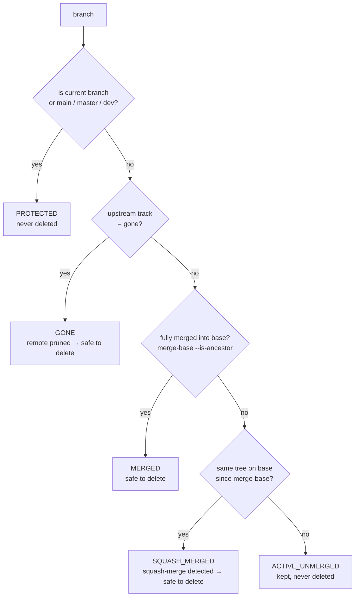
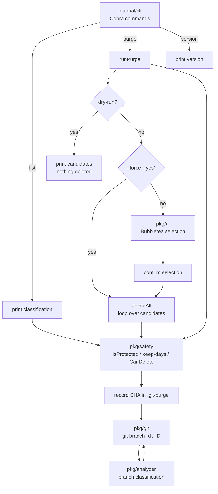

# Git-Purge

> The zero-friction local Git branch cleaner for modern developer workflows.

[](https://go.dev)
[](LICENSE)

---

## The Problem

When PRs are merged on GitHub/GitLab/Bitbucket, remote branches get deleted automatically — but your local machine accumulates dozens of dead branches. Cleaning them safely without losing unmerged work is a manual, error-prone chore.

**git-purge** solves this effortlessly.

---

## Features

- **Smart Squash-Merge Detection** — identifies branches merged via squash even when `git branch --merged` fails
- **Gone Branch Cleanup** — detects branches whose remote was pruned
- **Interactive TUI** — keyboard-driven terminal UI built with Bubbletea
- **Fail-Safe & Non-Destructive** — protected branches, SHA logging, `--dry-run` support
- **Blazing Fast** — pure Go, scans large repos in milliseconds

---

## Installation

**Option 1 — Install system-wide (available for all users, no PATH setup needed):**

```bash
sudo env GOBIN=/usr/local/bin go install github.com/cyber-pnl/git-purge/cmd/git-purge@latest
```

The binary is placed in `/usr/local/bin`, which is always on the system `PATH`, so `git-purge` is immediately available in any terminal:

```bash
git-purge version   # => git-purge dev
```

**Option 2 — Install to your Go bin directory:**

```bash
go install github.com/cyber-pnl/git-purge/cmd/git-purge@latest

# make sure $(go env GOPATH)/bin is on your PATH
export PATH="$PATH:$(go env GOPATH)/bin"
```

**Option 3 — Download a pre-compiled binary** from the [Releases](https://github.com/cyber-pnl/git-purge/releases) page and add it to your `PATH`.

---

## Usage

```bash
# Interactive mode (default)
git-purge

# Preview what would be deleted
git-purge --dry-run

# Non-interactive purge (for scripts/cron)
git-purge --force --yes

# Keep branches modified in the last 14 days
git-purge --keep-days 14

# Protect custom branches
git-purge --protect "main,master,release/*,staging"
```

---

## How It Works

**Branch classification** — every local branch is classified on a decision chain that never guesses: any doubt means the branch is kept.



**Squash-merge detection** — When a PR is squash-merged, the commit hash on `main` differs from the branch. git-purge compares the branch **tree** against `main`'s history to safely confirm the merge.

**Protected branches** — `main`, `master`, `dev`, and your current branch are never deleted. Custom patterns supported via `--protect`.

**Recovery log** — Every deletion records the branch SHA in `.git-purge/` for easy recovery via `git reflog` or `git branch <name> <sha>`.

---

## Architecture

The codebase is layered so that safety decisions are enforced no matter which entry point you use:



**Layer responsibilities**

```
internal/cli      → command handling, flags, orchestration (setup / purge / list)
pkg/analyzer      → decides WHAT a branch is (merged, squash-merged, gone, ...)
pkg/safety        → decides IF a branch may be deleted (protections, keep-days, logging)
pkg/git           → thin adapter over the `git` CLI (exec.Command)
pkg/ui            → interactive terminal UI (Bubbletea)
```

---

## Contributing

See [CONTRIBUTING.md](CONTRIBUTING.md) for guidelines.

## License

[MIT](LICENSE)
